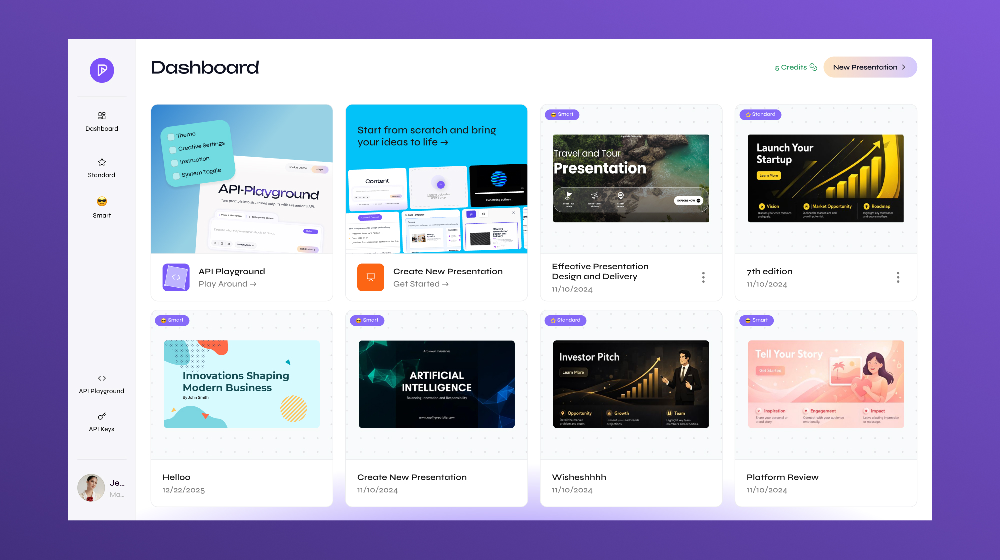

<!-- # Spire.Presentation for .NET -->
<!-- 


 -->

<div align="left">

## Presenton  
<!-- ## Open-Source AI Presentation Generator & API -->
**Open-Source AI Presentation Generator & API.**
**Self-hosted. Private. Fully customizable.**


[![Website][website-shield]][website-url]
[![Download][download-shield]][download-url]
[![Docs][docs-shield]][docs-url]
[![YouTube][youtube-shield]][youtube-url]
[![Discord][discord-shield]][discord-url]
<br>
[![Docker Pulls][docker-shield]][docker-url]
[![GitHub Stars][stars-shield]][stars-url]
[![License][license-shield]][license-url]
[![Platform][platform-shield]][platform-url]


<!-- Shields -->

[website-shield]: https://img.shields.io/badge/Website-presenton.ai-111827?style=flat&logo=google-chrome&logoColor=white
[website-url]: https://presenton.ai/

[download-shield]: https://img.shields.io/badge/Download-Latest%20Release-6C47FF?style=flat&logo=download&logoColor=white
[download-url]: https://presenton.ai/download

[docs-shield]: https://img.shields.io/badge/Docs-docs.presenton.ai-0ea5e9?style=flat&logo=readthedocs&logoColor=white
[docs-url]: https://docs.presenton.ai/

[youtube-shield]: https://img.shields.io/badge/YouTube-PresentonAI-FF0000?style=flat&logo=youtube&logoColor=white
[youtube-url]: https://www.youtube.com/@presentonai

[discord-shield]: https://img.shields.io/badge/Discord-Join%20Community-5865F2?style=flat&logo=discord&logoColor=white
[discord-url]: https://discord.gg/9ZsKKxudNE

[docker-shield]: https://img.shields.io/badge/Docker-ghcr.io/presenton/presenton-2496ED?style=flat&logo=docker&logoColor=white
[docker-url]: https://ghcr.io/presenton/presenton

[stars-shield]: https://img.shields.io/github/stars/presenton/presenton?style=flat
[stars-url]: https://github.com/presenton/presenton

[license-shield]: https://img.shields.io/badge/License-Apache%202.0-blue?style=flat
[license-url]: https://github.com/presenton/presenton/blob/main/LICENSE

[platform-shield]: https://img.shields.io/badge/Platform-Windows%20%7C%20macOS%20%7C%20Linux-lightgrey?style=flat
[platform-url]: https://presenton.ai/
</div>


<!--  -->
<p align="center">
  
</p>


### ✨ Why Presenton

No SaaS lock-in · No forced subscriptions · Full control over models and data

What makes Presenton different?
- Use your **existing PPTX files as templates**
- Fully **self-hosted**
- Works with OpenAI, Gemini, Anthropic, Ollama, or custom models
- API deployable
- Fully open-source (Apache 2.0)

#

### 📌 Try Presenton Cloud

Generate presentations over UI or API in our cloud. 
<!-- [](https://presenton.ai) -->

<p align="left">
  <a href="https://presenton.ai">
    
  </a>
</p>

<!-- [![Launch Presenton Cloud]](https://presenton.ai) -->

<p align="center">
  
</p>

#

### 🎛 UI Elements

<table>
<tr>
<td width="33%" align="center">
  
  <!-- <br><br> -->
  <strong>1) Add prompt, select number of slides and language
</td>

<td width="33%" align="center">
  
  <!-- <br><br> -->
  <strong>2) Review and edit outline
</td>


</tr>

<tr>
<td width="33%" align="center">
  
  <!-- <br><br> -->
  <strong>3) Select template
</td>

<td width="33%" align="center">
  
  <!-- <br><br> -->
  <strong>4) Present on app
</td>
</tr>
</table>

#

### Running Presenton

  <p>
    You can run Presenton in two ways:
    <strong>Docker</strong> for a one-command setup without installing a local dev
    stack, or the <strong>Electron desktop app</strong> for a native app
    experience (ideal for development or offline use).
  </p>

  **Option 1: Electron (Desktop App)**

   <p>
    Run Presenton as a native desktop application. LLM and image provider
    (API keys, etc.) can be configured in the app. The same environment variables
    used for Docker apply when running the bundled backend.
  </p>

  <p>
    <strong>Prerequisites:</strong> Node.js (LTS), npm, Python 3.11, and
    <a href="https://docs.astral.sh/uv/">uv</a>
    (for the Electron FastAPI backend in
    <code>electron/servers/fastapi</code>).
  </p>

  - Setup (First Time)
    <pre><code class="language-bash">cd electron
    npm run setup:env</code></pre>
    This installs Node dependencies, runs <code>uv sync</code> in the FastAPI
    server, and installs Next.js dependencies.
    
    Windows (PowerShell):
    <pre><code class="language-bash">docker run -it --name presenton -p 5000:80 -v "${PWD}\app_data:/app_data" ghcr.io/presenton/presenton:latest</code></pre>

  - Open Presenton
    <p>
    Open <a href="http://localhost:5000">http://localhost:5000</a> in the browser
    of your choice to use Presenton.
    </p>

  **Option 2: Docker**

  - Start Presenton
    Linux/MacOS (Bash/Zsh Shell):
    <pre><code class="language-bash">docker run -it --name presenton -p 5000:80 -v "./app_data:/app_data" ghcr.io/presenton/presenton:latest</code></pre>
    
    Windows (PowerShell):
    <pre><code class="language-bash">docker run -it --name presenton -p 5000:80 -v "${PWD}\app_data:/app_data" ghcr.io/presenton/presenton:latest</code></pre>

  - Open Presenton
    <p>
    Open <a href="http://localhost:5000">http://localhost:5000</a> in the browser
    of your choice to use Presenton.
    </p>
    
    <blockquote>
    <p>
      <strong>Note:</strong> You can replace <code>5000</code> with any other port
      number of your choice to run Presenton on a different port number.
    </p>
    </blockquote>

#

### ✨ Key Features

- 📂 Create PowerPoint files from scratch
- 📝 Edit existing PPT and PPTX files
- 📊 Insert charts, tables, shapes, and SmartArt
- 🖼 Add and manipulate images and multimedia
- 🔄 Convert PowerPoint to PDF, images, and other formats
- 🔍 Extract text and embedded objects
- ⚡ High performance and lightweight API
- 🚫 No Microsoft Office automation required
- 🌍 Supports .NET Framework and .NET Core
#

### 📺 Latest YouTube Videos
<!-- BEGIN YOUTUBE-CARDS -->

<p align="left">
<a href="https://youtu.be/vvCj23ySjLg">
  
</a>

<a href="https://youtu.be/rqr2J2ci0DI">
  
</a>

<a href="https://youtu.be/grKoA3u1CMk">
  
</a>

<a href="https://youtu.be/L25NSkZj7nk">
  
</a>
</p>

<!-- END YOUTUBE-CARDS -->

[![Subscribe][youtube-shield]](https://www.youtube.com/@presentonai?sub_confirmation=1)
<!-- <p align="left">
<a href="https://www.youtube.com/@presentonai?sub_confirmation=1">
  
</a>
</p> -->

#

## 🖼 Architecture Overview
---

## 🚀 Installation

### Install via NuGet Package Manager

```bash
Install-Package Spire.Presentation